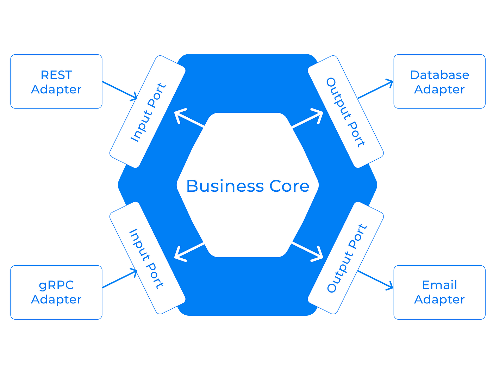

# Hexagonal Service

Hexagonal Architecture is a software design pattern that organizes code into a central domain (business logic) surrounded by “ports” (interfaces) and “adapters” (implementations).

It ensures that the core logic remains independent of frameworks, databases, or user interfaces — making systems modular, testable, and adaptable to future changes.

This project demonstrates a prototype and wrappers of how to keep the **business core independent** from frameworks, databases, and external systems — allowing effortless switching between persistence layers (e.g., JPA ↔ MongoDB) without changing domain code.

---

## Architecture Overview



At the heart lies the **Business Core (Domain Layer)**, surrounded by:
- **Input Ports & Adapters** → handle incoming requests (REST, gRPC, CLI, etc.)
- **Output Ports & Adapters** → manage outgoing interactions (Databases, Email, APIs, etc.)

### 🔸 Key Principles
- **Framework Agnostic Core** — domain logic depends on interfaces, not frameworks.
- **Replaceable Adapters** — swap databases or interfaces without touching business rules.
- **Testable Design** — pure domain services can be tested without infrastructure.
- **Explicit Boundaries** — input/output ports clearly define dependencies.

---
## 🚀 Getting Started

### 🧰 Prerequisites
- Docker Desktop installed and running
- Java 17+
- Maven 3.8+
- IntelliJ IDEA (recommended)

## Switching Between JPA and Mongo

Each database adapter implements the same output port:

```
public interface OrderRepositoryPort {
    String findById(String id);
    void saveOrder(FoodOrder order);
}
```
* JPA Adapter: JpaOrderRepositoryAdapter (@Profile("jpa"))
* Mongo Adapter: MongoOrderRepositoryAdapter (@Profile("mongo"))

```
-Dspring.profiles.active=mongo

```
## Why Hexagonal Architecture?

| Benefit             | Description                                                             |
| ------------------- | ----------------------------------------------------------------------- |
| 🔄 **Adaptable**    | Swap adapters (JPA → Mongo, REST → gRPC) without touching domain logic. |
| 🧱 **Maintainable** | Each layer has a single responsibility and clear boundary.              |
| 🧩 **Testable**     | The core domain can be tested without Spring context or databases.      |
| 🚀 **Extensible**   | New features integrate cleanly via new input/output adapters.           |
